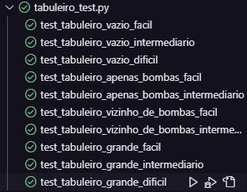

# CAMPO MINADO
Trabalho prático individual de Tópicos Especiais II pedido pelo professor Alcemir Santos - 2023.1

## DESCRIÇÃO
Você trabalha numa empresa que desenvolve jogos simples para permitir que os usuários passem o seu tempo livre jogando. Sua equipe acaba de fazer um brainstorming e decidir quais e quem desenvolveria os próximos jogos. Você ficou responsável por desenvolver um jogo de Campo Minado. A equipe já desenhou o protótipo de baixa fidelidade, que é ilustrado ao lado.

## REQUISITOS

Asregras do jogo são simples: O jogador deve marcar com uma bandeira todos as zonas que ele imaginar conter uma bomba. O jogador só tem três ações possíveis: 

(i) colocar uma bandeira em uma zona indicando que a mesma contém uma bomba, 
(ii) remover uma bandeira previamente colocada ou 
(iii) e descobrir uma zona sem bandeira. Não é possível descobrir uma zona com bandeira, é necessário remover uma bandeira antes de descobri-la. 

Não é possível cobrir uma zona depois de descobri-la. Todas as zonas iniciam cobertas e sem bandeira. Cada zona pode ser área limpa ou conter uma bomba. As zonas limpas que fazem fronteira com zonas com bomba, indicam quantas bombas aparecem adjacentes a ela. Cada zona pode ter de zero (0) a oito (8) zonas que contém bomba adjacentes a ela. A quantidade de bombas adjacentes a uma zona é revelada ao descobri-la. O jogador vence se descobrir todas as zonas contendo bomba, sem explodir nenhuma. Uma bomba explode se o jogador descobrir a zona que ela se encontra. A pontuação do jogo é dada pelo tempo levado para descobrir todas as bombas em segundos. O número de bombas é fixo a cada partida nível jogado. Considere três graus de dificuldade, dados pelas dimensões do tabuleiro e a densidade de bombas espalhadas no campo: fácil (8x8 – 10 bombas); intermediário (10x16 – 30 bombas); e difícil (24x24 – 100 bombas). Mantenha uma histórico de resultados para consulta.

Os casos de requisitos não especificados devem ser coletados com o professor da disciplina.

## Requisitos gerados para a criação do jogo

*Meus Requisitos para o Jogo:*

1. O jogo deve ser um jogo de Campo Minado ✅
2. O jogador deve ser capaz de selecionar um nível de dificuldade fácil no início do jogo. ✅
    -> Testar se é possível selecionar o nível de dificuldade fácil ✅
3. O jogador deve ser capaz de selecionar um nível de dificuldade intermediário no início do jogo. ✅
    -> Testar se é possível selecionar o nível de dificuldade intermediário ✅
4. O jogador deve ser capaz de selecionar um nível de dificuldade difícil no início do jogo. ✅
    -> Testar se é possível selecionar o nível de dificuldade fácil ✅
5. O jogo deve gerar um tabuleiro com base no nível de dificuldade selecionado. ✅
    
6. O tabuleiro deve ser composto por células retangulares que o jogador pode revelar. ✅
7. O tabuleiro deve ser preenchido com um número específico de bombas com base no nível de dificuldade. ✅
8. O jogador deve ser capaz de clicar nas células para revelar o conteúdo delas. ✅
9. Se o jogador clicar em uma célula com uma bomba, o jogo deve terminar com uma derrota.✅
10. As células reveladas devem mostrar o número de bombas adjacentes a elas.✅
11. Se uma célula não tiver bombas adjacentes, todas as células adjacentes a ela sem bombas adjacentes devem ser reveladas automaticamente.✅
12. O jogador deve ser capaz de marcar ou desmarcar uma célula com uma bandeira para indicar a presença de uma bomba.✅
13. O jogador só deve ser capaz de marcar uma célula como uma bandeira se não tiver sido revelada.✅
14. O jogador deve ser capaz de remover uma bandeira previamente colocada em uma célula.✅
15. O jogador deve ser capaz de reiniciar o jogo a qualquer momento. ✅
16. O jogo deve calcular o tempo que o jogador leva para concluir o jogo. ✅
17. O jogador deve ser capaz de vencer o jogo ao revelar todas as células sem bombas sem explodir nenhuma. ✅
18. O jogo deve mostrar uma mensagem de vitória quando o jogador vencer. ✅
19. O jogo deve mostrar uma mensagem de derrota quando o jogador perde.✅
20. O jogador deve ser capaz de iniciar um novo jogo após uma vitória ou derrota. ✅
21. O jogo deve permitir que o jogador saia do jogo e retorne ao menu principal a qualquer momento. ✅

*Requisitos de Interface do Usuário:*

22. O jogo deve ter uma interface gráfica amigável. ✅
23. Deve haver um menu principal na tela de jogo para retornar ao menu principal. ✅
24. Deve haver uma contagem de bombas marcadas na tela de jogo. 
25. Deve haver um cronômetro na tela de jogo para registrar o tempo de jogo. 
26. O tabuleiro do jogo deve ser visível e interativo. ✅
27. O jogo deve exibir células fechadas como um bloco sólido. ✅
28. As células reveladas devem mostrar o número de bombas adjacentes. ✅
29. O jogo deve usar bandeiras para indicar células com bombas marcadas pelo jogador. ✅
30. As células com bandeiras devem ser claramente identificáveis. ✅
31. O jogo deve ter mensagens de vitória e derrota visíveis na tela de jogo. ✅
32. O jogo deve ter uma tela de menu principal com opções para iniciar um novo jogo, acessar o histórico de resultados e sair do jogo. ✅ + -
33. Deve haver opções de nível de dificuldade claramente visíveis no menu principal. ✅
34. O histórico de resultados deve ser apresentado de forma legível e organizada. ✅
35. O jogo deve ter um design agradável e fácil de usar. ✅ + -
36. Deve haver um ícone ou logotipo representativo na interface. ✅
