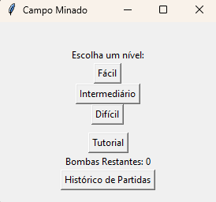
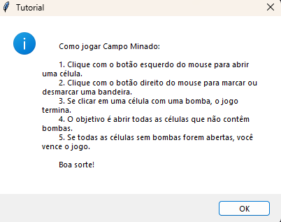
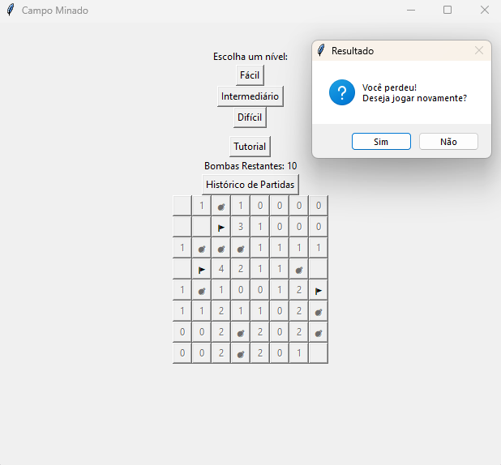
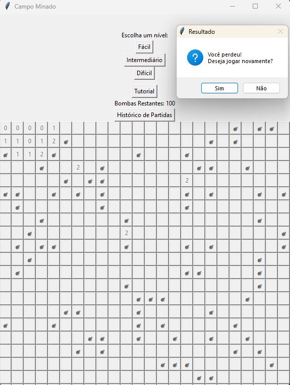
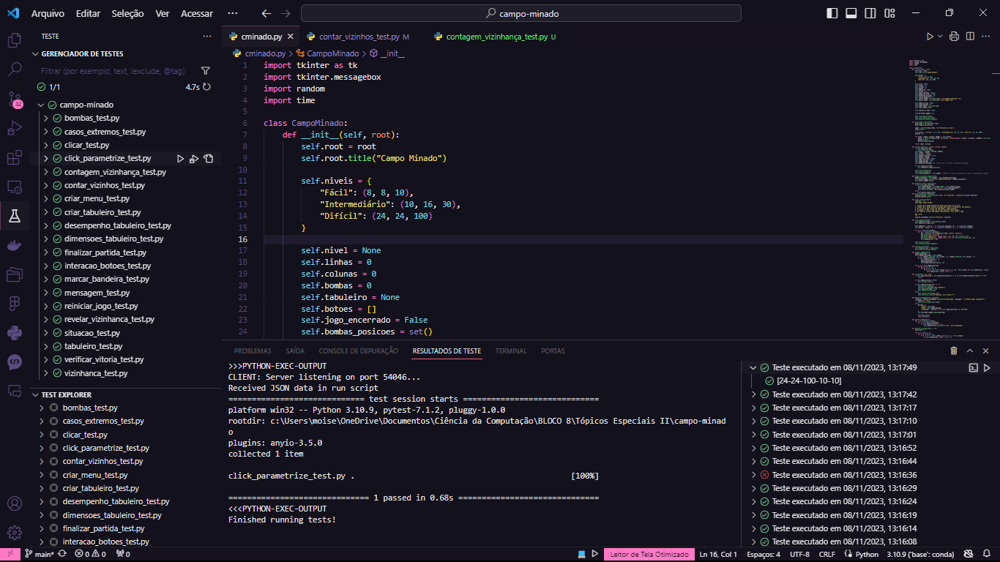

# CAMPO MINADO

## Tópicos

- [Apresentando o jogo](#apresentando-o-jogo)
- [Como rodar o projeto?](#como-rodar-o-projeto)
- [Como consigo executar  os testes?](#como-executar-os-testes)
- [Documentação](./Documentação.md)

## Apresentando o jogo

### Menu do Jogo


### Tutorial


### Jogo fácil



### Jogo intermediário


### Jogo Difícil


</p>

## Como rodar o Projeto?

### Entre na raiz do projeto 

```sh
cd campo-minado
```

### Instale todas as dependências

```sh
pip3 install -r dependencias.txt
```

### Execute o jogo já compilado

```sh
py cminado.py
```
ou
```sh
./dist/cminado.exe
```

## Como executar os testes?

### Dentro do diretório do projeto (caminho/campo-minado) execute

```sh
py -m pytest [nome_test.py]
```

### Testes no jogo
