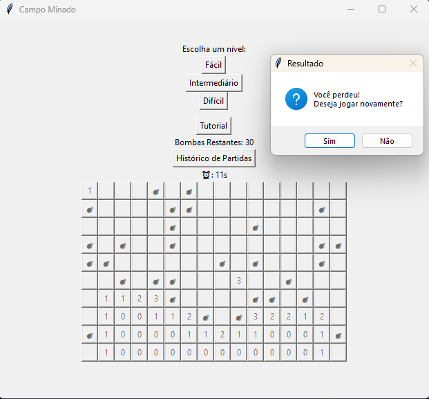

# CAMPO MINADO

## Tópicos

- [Apresentando o jogo](#apresentando-o-jogo)
- [Como rodar o projeto?](#como-rodar-o-projeto)
- [Como consigo executar  os testes?](#como-executar-os-testes)
- [Documentação](./Documentação.md)

## Apresentando o jogo

### Menu do Jogo


### Tutorial


### Jogo fácil


### Jogo intermediário



### Jogo Difícil


</p>

## Como rodar o Projeto?

### Entre na raiz do projeto 

```sh
cd campo-minado
```

### Instale todas as dependências

```sh
pip install pytest
```
ou
```sh
pip3 install pytest
```

### Execute o jogo já compilado

```sh
python cminado.py
```
ou 

```sh
python3 cminado.py
```
ou
```sh
./dist/cminado.exe
```

## Como executar os testes?

### Dentro do diretório do projeto (caminho/campo-minado) execute

```sh
pytest [nome_test.py]
```

### Testes no jogo


### Considerações finais
*"A vida é uma sucessiva sucessão de sucessões que se sucedem sucessivamente até sucederem o sucesso, e ela cobra."*